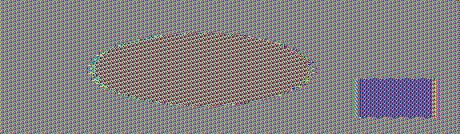

#### Ryan Dotzlaw

### Task 1: Encryption mode: ECB vs CBC

This task involves encrypting the following image with AES-ECB and AES-CBC encryption modes and comparing them.


To encrypt this image, I used `openssl enc` with the following commands.

For ECB encryption:
```
openssl enc -aes-128-ecb -e -in test.bmp -out encrypted -p
```

For CBC encryption:
```
openssl enc -aes-128-cbc -e -in test.bmp -out encrypted -p
```

Then by overwriting the header of the encrypted files with the header from the unencrypted file, we can view the encrypted images.

Using the following commands to overwrite the header:
```
head -c 54 test.bmp > header
tail -c +55 encrypted > body
cat header body > encrypted.bmp
```

We can now view the encrypted files as images.

The image encrypted with ECB looks like:



The image encrypted with CBC looks like:


This isn't particularly suprising, considering what we learned about ECB and CBC in class.

While ECB adds some 'noise' to the image, you can clearly make out the circle and the square that make up the original unencrypted image. You can even make out the colors of the original image.
This is because ECB applies the exact same encryption operation to all 'blocks', which means that parts of the plaintext that are identical result in identical ciphertext.

In contrast, using CBC makes the entire image 'noise', preventing you from learning any information about the original unencrypted image.
This is becasue CBC doesn't apply the exact same encryption operation to each block, instead the encryption of the current block relies on the previous block, hence the name 'Chained Block Cipher'.
This results in identical plaintext blocks having different results as ciphertext.

### Task 2: Calculating Keys

Using the following code:

```
#include <stdio.h>
#include <openssl/bn.h>

#define NBITS 128

void printBN(char *msg, BIGNUM * a)
{
   /* Use BN_bn2hex(a) for hex string
    * Use BN_bn2dec(a) for decimal string */
   char * number_str = BN_bn2hex(a);
   printf("%s %s\n", msg, number_str);
   OPENSSL_free(number_str);
}

int main ()
{
  BN_CTX *ctx = BN_CTX_new();

  BIGNUM *p = BN_new();
  BIGNUM *q = BN_new();
  BIGNUM *e = BN_new();
  	
	BN_hex2bn(&p,"F7E75FDC469067FFDC4E847C51F452DF");
	BN_hex2bn(&q,"E85CED54AF57E53E092113E62F436F4F");
	BN_hex2bn(&e,"0D88C3");

	BIGNUM *n = BN_new();
	// n = p * q
	BN_mul(n, p, q, ctx);
	printBN("n = ", n);
	
	BIGNUM *phi = BN_new();
	// phi = (p-1) * (q-1)
	BIGNUM *p_one = BN_new();
	BN_hex2bn(&p_one, "F7E75FDC469067FFDC4E847C51F452DE");
	BIGNUM *q_one = BN_new();
	BN_hex2bn(&q_one, "E85CED54AF57E53E092113E62F436F4E");
	
	BN_mul(phi, p_one, q_one, ctx);

	// find 'd', the modular inverse of e and phi s.t. e*d % phi == 1

	BIGNUM *d = BN_new();
	BN_mod_inverse(d, e, phi, ctx);
	printBN("d = ", d);

  return 0;
}
```

We get the output:

```
n =  E103ABD94892E3E74AFD724BF28E78366D9676BCCC70118BD0AA1968DBB143D1
d =  3587A24598E5F2A21DB007D89D18CC50ABA5075BA19A33890FE7C28A9B496AEB
```

Which is then verified by using the code for Task 3 and 4 to encrypt and decrypt the message "A top secret!"

Firstly using the values:

```
"A top secret!".encode("utf-8").hex()) in python gives:
'4120746f702073656372657421'

a = 4120746f702073656372657421
b = 0D88C3
n = E103ABD94892E3E74AFD724BF28E78366D9676BCCC70118BD0AA1968DBB143D1
```

For `a ^ b % n` in the code below.

We get the ciphertext:

```
90A81343DFE08415EDF79337CDE00457BAB56AFFA1B0CE5647BF9025665B396A
```

Then decrypting it with the values:

```
a = 90A81343DFE08415EDF79337CDE00457BAB56AFFA1B0CE5647BF9025665B396A
b = 3587A24598E5F2A21DB007D89D18CC50ABA5075BA19A33890FE7C28A9B496AEB
n = E103ABD94892E3E74AFD724BF28E78366D9676BCCC70118BD0AA1968DBB143D1
```

We get the resulting decrypted hex:

```
4120746f702073656372657421
```

Which we can then verify in python:

```
bytes.fromhex("4120746F702073656372657421").decode()

'A top secret!'
```

Thus concluding that our calculated `d` value is correct.

I initially tried implementing a naive algorithm in python to compute 'd', but it was just taking forever. 
It took so long that I was able to create the code above in C to calculate 'd' and finished the task before my python code finished calculating 'd'.


### Task 3 and 4: Encrypting and Decrypting a Message

Both of theses tasks are done with the following `C` code to utilize the `BIGNUM` openssl library.

```
#include <stdio.h>
#include <openssl/bn.h>

#define NBITS 128

void printBN(char *msg, BIGNUM * a)
{
   /* Use BN_bn2hex(a) for hex string
    * Use BN_bn2dec(a) for decimal string */
   char * number_str = BN_bn2hex(a);
   printf("%s %s\n", msg, number_str);
   OPENSSL_free(number_str);
}

int main ()
{
  BN_CTX *ctx = BN_CTX_new();

  BIGNUM *a = BN_new();
  BIGNUM *b = BN_new();
  BIGNUM *n = BN_new();
  BIGNUM *res = BN_new();
  // Initialize a, b, n
  BN_hex2bn(&a, "4120746f702073656372657421");
  BN_hex2bn(&b, "010001");
  BN_hex2bn(&n, "DCBFFE3E51F62E09CE7032E2677A78946A849DC4CDDE3A4D0CB81629242FB1A5");

  BN_mod_exp(res, a, b, n, ctx);
  printBN("a^b mod n = ", res);

  return 0;
}

```

##### For task 3:
 
a, b, and n are set to the following values:

After running `"A top secret!".encode("utf-8").hex())` in python we get the value for 'a'

```
a = "4120746f702073656372657421"
b = "010001"
n = "DCBFFE3E51F62E09CE7032E2677A78946A849DC4CDDE3A4D0CB81629242FB1A5"
```

Then, simply compiling and running the code outputs:

```
a^b mod n =  6FB078DA550B2650832661E14F4F8D2CFAEF475A0DF3A75CACDC5DE5CFC5FADC
```

To validate this, we can then take this result and plug it in for 'a', along with a new value for 'b':

```
a = "6FB078DA550B2650832661E14F4F8D2CFAEF475A0DF3A75CACDC5DE5CFC5FADC"
b = "74D806F9F3A62BAE331FFE3F0A68AFE35B3D2E4794148AACBC26AA381CD7D30D"
```

Then by compiling and running the code again we get:

```
a^b mod n =  4120746F702073656372657421
```

We can then run `bytes.fromhex("4120746F702073656372657421").decode()` in python to get the result:

```
"A top secret!"
```

One thing I would like to point out is the sheer efficiency of the openssl `BIGNUM` library.

I was able to encrypt the plaintext instantly with python, 
but attempting to decrypt the ciphertext with `m = (c ** d) % n` ran excessively long - around 10 minutes before I gave up.

This is most likely due to the fact that the 'd' value is almost as long as the ciphertext itself, resulting in a very large number to the power of another very large number.
No doubt there would be a more efficient way to implement this in python, but it was easier just to use the given `BIGNUM` sample code to create a C implementation.

##### For task 4:

Using the same code as before, setting the a,b, and n values to:

```
a = "8C0F971DF2F3672B28811407E2DABBE1DA0FEBBBDFC7DCB67396567EA1E2493F"
b = "74D806F9F3A62BAE331FFE3F0A68AFE35B3D2E4794148AACBC26AA381CD7D30D"
n = "DCBFFE3E51F62E09CE7032E2677A78946A849DC4CDDE3A4D0CB81629242FB1A5"
```

Compiling and running the code results in:

```
a^b mod n =  50617373776F72642069732064656573
```

And by converting the hex with python, we get:

```
'Password is dees'
```

Which isn't much of a suprise, considering we've already used this same code to encrypt and decrypt successfully.