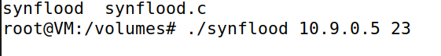

#### Ryan Dotzlaw

Do Tasks 1.2 and 1.3

#### Preamble:

This lab focuses on a SYN Flooding attack.

A SYN flooding attack occurs when an attacker sends a large volume of SYN packets to the victim machine with random source IP addresses.
Since a SYN packet is the first step in establishing a TCP connection, this leads to the victim machine sending off SYN + ACK packets to the random source IP addresses.
The machines at the random source IP aren't trying to establish a TCP connection with the victim machine, so the victim doesn't get a reply often, forcing them to wait until the connection times out.
This waiting, along with the high volume of SYN packets sent by the attacker, leads to the victim machines TCP connection queue filling up, preventing any legitimate connections from being established.

The countermeasure used in the lab is the `SYN Cookie` countermeasure.

Essentially, instead of each incoming TCP connection holding a spot in the TCP connection queue, the victim machine will pass along a cookie with their SYN + ACK response, and then remove the connection from the queue.
If the victim machine gets a ACK response that contains a cookie, the victim will use the connection information to recalculate the cookie. 
If the recalculated cookie matches the cookie sent in the ACK response the connection will be established.

This countermeasure prevents dummy SYN packets used in the SYN flooding attack from taking up space in the TCP connection queue.
Allowing space for legitimate connections to establish connection with the victim machine.

#### Task 1.2: 

Firstly, we need to set up the docker containers for our attacker and our victims.

Once we put the `labsetup.zip` on the VM, we can use the `dcbuild` and `dcup` commands to build and start the containers.

As we can see, we have two user containers, a victim container, and an attacker container.

Then we compile the attack program on our virtual machine. 

We put the compiled program into the `volumes` folder in the `labsetup` directory.
This allows the attacker container to access it, since it is configured to mount the `volumes` folder.

After that, we run it on the attacker container, aiming for the victim container.

After some time, we use `netstat` on the victim container to check the TCP connections that have the `SYN_RECV` state.

These are the connections where the victim machine is waiting to time out on.

We can see that there are 97 half-active connections with the `SYN_RECV` state.

As a side note, one fourth of the TCP queue is reserved for previous connections, so of the total queue of 128, only 96 is for new connections.

Using `ip tcp_metrics flush` in the victim machine will remove all records of previous connections

Then, on our virtual machine, when we try to establish a TCP connection with the victim container via `telnet`, we are unable to.

This is due to the fact that the connection queue for the victim machine is full, therefore it is unable to establish any more TCP connections until some of them time out.

#### Task 1.3:

Now we re-enable the countermeasures for the victim container.

Then we run the attack again, and look at the half-active connections with the `SYN_RECV` state.

We can see that there are 128 half-active connections.

Interestingly, this is more than there was without the `SYN Cookie` countermeasures. 
I assume this is because when using the countermeasures, theres no need to reserve a fourth of the TCP connection queue for previous connections, since all incoming connections will leave the queue immediately anyways.

When we try to connect to the victim container via `telnet`, we can see that we are able to connect even though the attack is ongoing.

