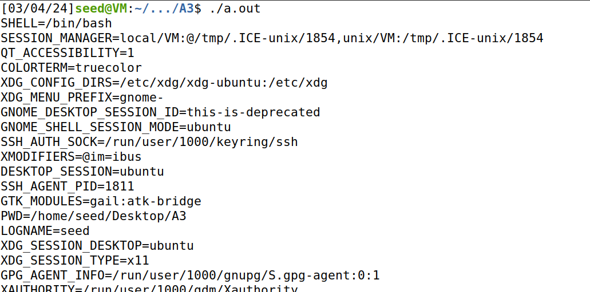
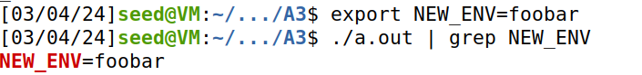
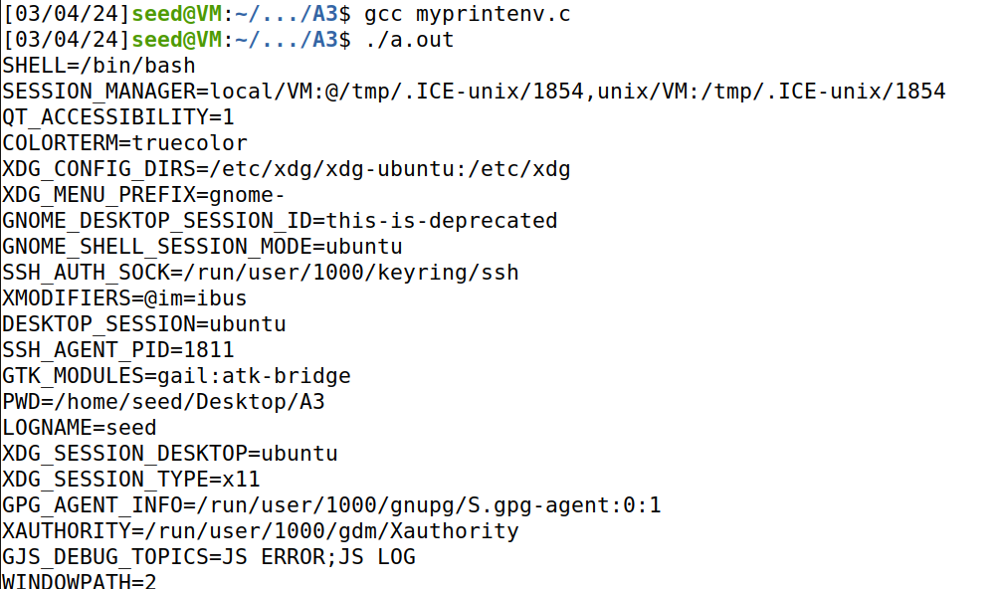

#### Ryan Dotzlaw

Do tasks 1, 2, 5, and 6

#### Task 1: Manipulating Environment Variables

Listing the environment variables can be done with the `env` or `printenv` bash commands, like so:


Setting or modifying an environment variable can be done with the `export` command, and removing one can be done with the `unset` command, like so:


#### Task 2: Passing Environment Variables from Parent Process to Child Process

Using the code given in `myprintenv.c`, which is as follows:

```
#include <unistd.h>
#include <stdio.h>
#include <stdlib.h>

extern char **environ;

void printenv()
{
  int i = 0;
  while (environ[i] != NULL) {
     printf("%s\n", environ[i]);
     i++;
  }
}

void main()
{
  pid_t childPid;
  switch(childPid = fork()) {
    case 0:  /* child process */
      printenv();          
      exit(0);
    default:  /* parent process */
      // printenv();       
      exit(0);
  }
}
```

Then, compiling the code and running it gives the following output:



We can see that this even includes environment variable that I've set:



From there, we modify the code by commenting out the `printenv()` command in `case 0`, and uncommenting the `printenv()` in `case 1`, then compiling and running the code again.

The output is as follows:




After running again and piping the results into `out1` and `out2` respectivly, we can use the diff command, with the `-s` flag to tell us if these files are identical.


From the output we can see that the files are identical.

This means that both the parent process and the child process that forked off share the same environment variables.

If there was a vunerable parent program where an attacker could change the `PATH` environment variable (perhaps by exploiting a buffer overflow or similar attack), 
and a child process that ran some bash command like `dir`,
then an attacker could change the `PATH` variable in the parent process to point to a directory with a malicious program called `dir`.

This would result in the child process inheriting the `PATH` env and executing the malicious program unintentionally.

This would be far less challenging than trying to cram an entire program into a buffer overflow attack.

#### Task 5: Environment Variable and Set-UID Programs

We create the program `env.c` with the following code:

```
#include <stdio.h>
#include <stdlib.h>
extern char **environ;
int main()
{
	int i = 0;
	while (environ[i] != NULL) {
		printf("%s\n", environ[i]);
		i++;
	}
}
```

This program prints out all environment variables.

From there we compile the program with this command:

```
gcc env.c -o t5
```

and modify it with `chown` and `chmod` to make it a `Set-UID` program with `root` as it's owner.


Then we change several environment variables as follows:


Now we run the program, getting the output:


Clearly an output of environment variables, however, notice the following:


From this we can see that some environment variables are passed from the user's envs to a Set-UID process, but not all of them.

Specifically `LD_LIBRARY_PATH` was not passed to the program.


#### Task 6: The PATH Environment Variable and Set-UID Programs

We create a program called `just_ls.c` with the following code:

```
int main()
{
	system("ls");
	return 0;
}
```

From there we compile it, change it's owner to root, and make it a Set-UID program:


Running it gives the result:


Then, by modifying the `PATH` env, we can change where the `system(ls)` looks for the `ls` program.

We modify the path so it looks in the `home/seed` directory first; our user home directory.


Then we create a 'malicious' program and compile it into an executable called `ls` and drop it in the `home/seed` directory.

The malicious program has the following code:

```
#include <stdio.h>
#include <unistd.h>
int main()
{
	if(geteuid()){
		printf("Nothing to see here, just a normal user program\n");
	} else {
		printf("You got hacked!!!\n");
	}
	return 0;
}
```

The program will display "You got hacked!!!" if the effective user id is 0, AKA root.


Then when we execute our `just_ls` program and the output is now as follows:


This means that we were able to execute a custom program by changing the `PATH` env.

Additionally, since `just_ls` was a root owned Set-UID program, the effective permissions for our malicious program were high enough to 'hack' the user.